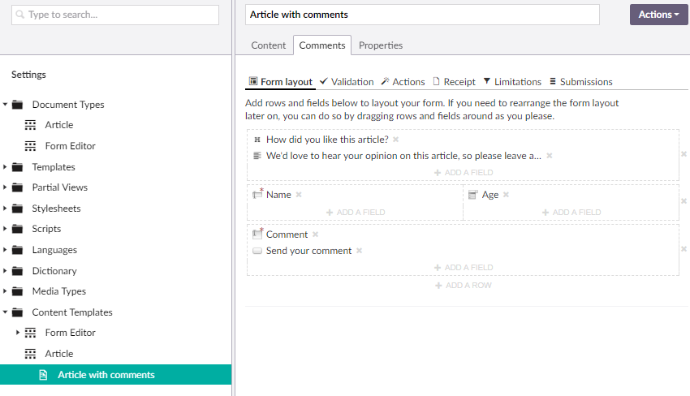
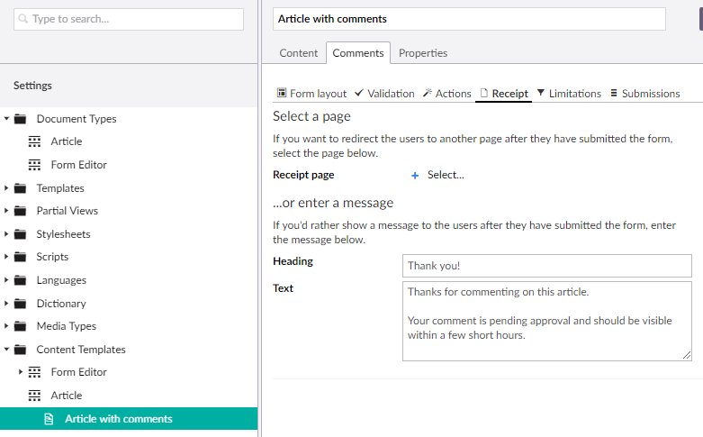
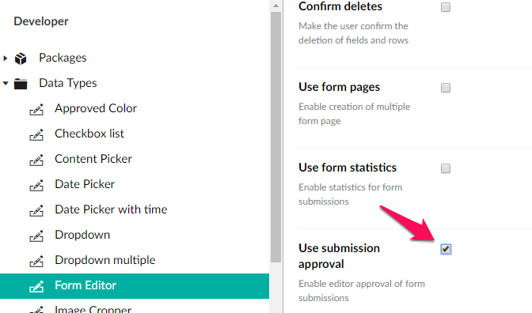
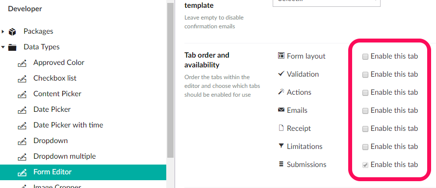
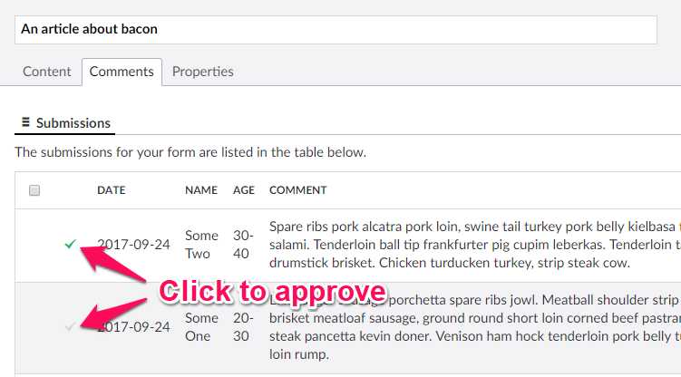

# Tutorial: Comments with moderation

In this tutorial we'll create a comment section for an article, and use the approval system in Form Editor to let the editors moderate the comments. Since it's all built into Form Editor, you won't have to write a single line of custom code to make this happen.

We'll also utilize the *Content Templates* feature introduced in Umbraco 7.7 to create a hassle-free workflow for the editors.

Let's get to it, shall we?

## Setting up

Before we start, you need to install Form Editor and create a Form Editor data type (check the [quick start tutorial](QuickStart.md) or the [installation documentation](../Docs/install.md) for details). 

### Creating the document type

Create a document type called *Article* and add:

1. A tab named *Content*. This tab will contain the article content.
2. A property named *Heading* of type *Textstring* on the *Content* tab.
3. A property named *Body text* of type *Richtext editor* on the *Content* tab.
4. A tab named *Comments*. This tab will contain the comments form.
5. A property named *Form* of type *Form Editor* on the *Comments* tab.

The final result should look something like this:


### Creating the content template

Once the document type is done, create a content template for it and name it *Article with comments*. We'll use this to ensure that all our *Article* pages are created with a correctly configured comments form.

On the *Comments* tab of the content template, create the form layout you'd like for the comments form. You can add all the rows and fields you want, but for the sake of this tutorial, make sure you at least add:

* A *Name* field (of type *Textbox*).
* A *Comment* field (of type *Text area*).



Now go to the *Receipt* tab of the *Form* property and enter a suitable receipt message.



### Configuring and locking down Form Editor

We need to make a few changes to the Form Editor data type. First and foremost we need to enable the option *Use submission approval* - this activates the approval system:



Using the content template we'll have a correctly configured comments form with each new article that's created. We really don't want the editors messing around with it - they should only be concerned with writing articles and moderating the submitted comments. Fortunately we can lock down Form Editor, so only the *Submissions* tab is shown to the editors. This is done by configuring the *Tab order and availability* on the data type:



*Note: This also influences the tabs available when editing the content template. If you need to change the form configuration in the content template later on, you'll have to enable the tabs temporarily until you're done changing things.*

## Creating an article

Go to the content section and create an *Article* page using the *Article with comments* content template: 


Fill out the article content on the *Content* tab and then switch to the *Comments* tab. As expected, only the *Submissions* tab is visible:


Behind the scenes, the content template has created the correct form layout and configuration for us. In other words: *The editors don't have to do a thing!* When they create an article, they need only focus on the content, and of course the subsequent comments moderation. 

That's awesome! Content templates rock!

## Rendering the article

We're going to render the pieces of the article page in the following order:

1. The article content.
2. The article comments (if there are any).
3. The comments form.

We don't want a page reload and subsequent scroll-to-top when the comments form is submitted, so we'll use the [Async rendering](../Docs/render.md) to render the form. This way the comments form will be replaced by the receipt message you just entered when the form is submitted.

The following code listing contains the entire template for the *Article* page. Have a look at the [documentation](../Docs/submissions_list.md) for working with form submissions if you want to learn more about fetching and rendering the form submissions.

```html
@using FormEditor;
@inherits Umbraco.Web.Mvc.UmbracoTemplatePage
@{
  Layout = null;

  // get the comments form model (named "form" on the content type)
  var form = Model.Content.GetPropertyValue<FormModel>("form");
  // get the 20 most recent approved comments (default sort is by creation date) 
  var formData = form.GetSubmittedValues(
    perPage: 20, 
    sortDescending: true
  );  
}
<!DOCTYPE html>
<html>
<head>
  <title>@Model.Content.Name</title>
  <link rel="stylesheet" href="http://getbootstrap.com/dist/css/bootstrap.min.css"/>
  @* add some styles for Form Editor *@
  <style>
    /* required field indicator on the field labels */
    div.form-group.required > label:after {
      content: ' *';
      color: #a94442;
    }
    
    small {
      color: #888;
    }
  </style>
</head>
<body>
  <div class="container">
    @* 1. render the article content *@
    <h1>@Model.Content.GetPropertyValue("heading")</h1>
    <p>
      @Model.Content.GetPropertyValue("bodyText")
    </p>
  
    @* 2. render the article comments if there are any *@
    @if(formData.Rows.Any())
    {
      <h2>Here are the most recent comments for this article</h2>
      foreach(var row in formData.Rows)
      {
        // find the "name" and "comment" fields
        var nameField = row.Fields.FirstOrDefault(f => f.FormSafeName.ToLowerInvariant().Contains("name"));
        var commentField = row.Fields.FirstOrDefault(f => f.FormSafeName.ToLowerInvariant().Contains("comment"));
        <div>
          <small>On @row.CreatedDate.ToShortDateString() @row.CreatedDate.ToShortTimeString(), <strong>@nameField.Value</strong> wrote:</small>
          <p>
            @Html.Raw(Umbraco.ReplaceLineBreaksForHtml(commentField.Value ?? ""))
          </p>
          <hr/>
        </div>
      }
    }
  </div>
  
  @* 3. render the comments form with the Async partial and include the relevant assets *@
  @Html.Partial("FormEditor/Async", Umbraco.AssignedContentItem)
  <script src="https://ajax.googleapis.com/ajax/libs/angularjs/1.4.5/angular.min.js"></script>
  <script src="/JS/FormEditor/FormEditorAsync.js" type="text/javascript"></script>
</body>
</html>
```

Paste this code into your *Article* template, and then go have a look at the article you created. 

## Approving the comments

When you have submitted some comments to the article, they'll need approving before they're shown alongside the article. 

Go back to the *Comments* tab and approve the submissions by clicking the checkmarks. When they turn green, the submissions are approved. 



Now go back and view the article. The approved comments should appear between the article content and the comments form:


## Wrapping up

This tutorial has shown one way of using the approval system in Form Editor. Hopefully you'll find other clever ways to put it to good use. 

By now you should also have an idea of just how awesome content templates are, and how they introduce a whole new way of utilizing forms. 

Happy coding!